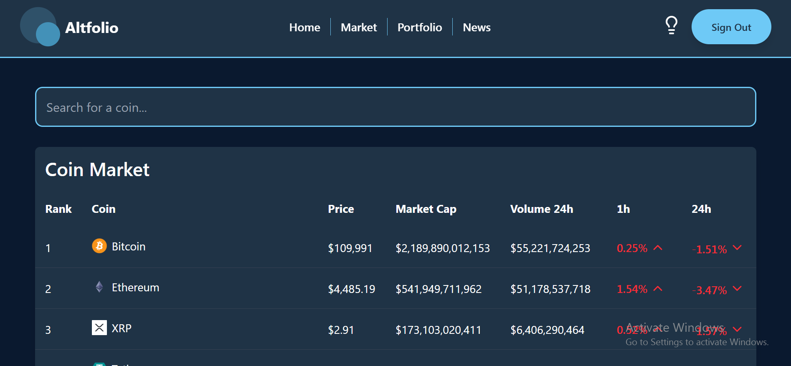
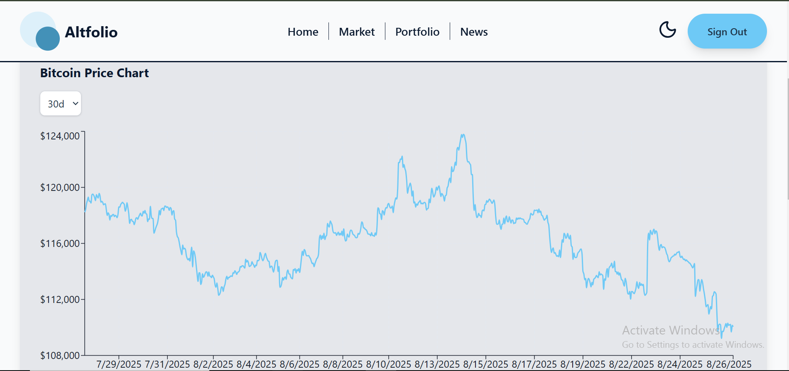
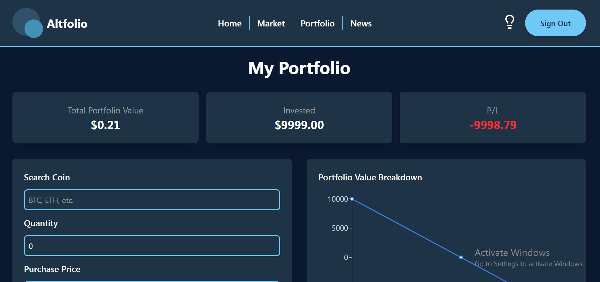

🚀 Crypto Tracker App

A modern crypto tracking web application built with React, Supabase, and Tailwind CSS.
It allows users to track global market data, search coins, view detailed coin stats, stay updated with crypto news, and manage their own investment portfolio with profit/loss tracking.

🌟 Features

✅ Authentication – Secure user login/signup with Supabase
✅ Global Market Data – Real-time market stats (market cap, BTC dominance, etc.)
✅ Search Coins – Fast search with filters
✅ Coin Detail Page – Price, volume, market cap, charts, and more
✅ Portfolio Management – Add coins with buy price & amount → See total value & profit/loss
✅ Charts – Interactive price & portfolio charts using Recharts
✅ Crypto News – Latest crypto news from external API
✅ Dark & Light Mode – Theme switcher with Tailwind
✅ Responsive Design – Works on all devices
✅ Error & Loading States – Smooth user experience

🛠 Tech Stack

Frontend: React + Vite

Styling: Tailwind CSS (with dark/light mode)

Backend / Auth / DB: Supabase

Charts: Recharts

Deployment: Vercel

📸 Screenshots

⚡ Installation & Setup

Clone the repo:

git clone https://github.com/thiri-dev/Altfolio.git
cd altfolio

Install dependencies:

npm install

Add your environment variables (create .env file):

VITE_SUPABASE_URL=your-supabase-url
VITE_SUPABASE_KEY=your-supabase-anon-key

Run locally:

npm run dev

Build for production:

npm run build

🚀 Deployment

This app is deployed on Vercel.
https://altfolio-5hgiit1je-thi-ris-projects.vercel.app/

📚 Learning Outcomes

While building this project I learned:

How to integrate Supabase for auth & database

Handling global API data & caching

State management with React hooks

Implementing dark/light mode with Tailwind

Error handling & loading states for better UX

Deploying a full-stack app on Vercel

🤝 Contributing

Contributions are welcome! Please fork the repo and submit a PR.

📩 Contact

👩‍💻 Built by Thi Ri

GitHub: https://github.com/thiri-dev

LinkedIn: https://www.linkedin.com/in/thi-ri-a5a2a736b/

✨ If you like this project, don’t forget to star ⭐ the repo!